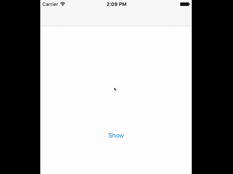

# NavigationPopDownView
iOS Navigation Pop Down from the UINavigationController, similar to Facebook's no internet status bar.

##Looks a little like this:

##How to use

Call this method 
`showNavigationDropDownView(self.navigationController!, message: "Message", height: 25)`
